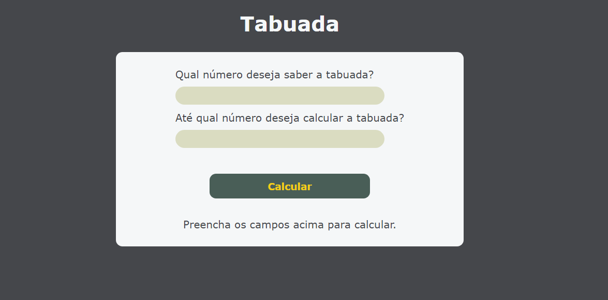
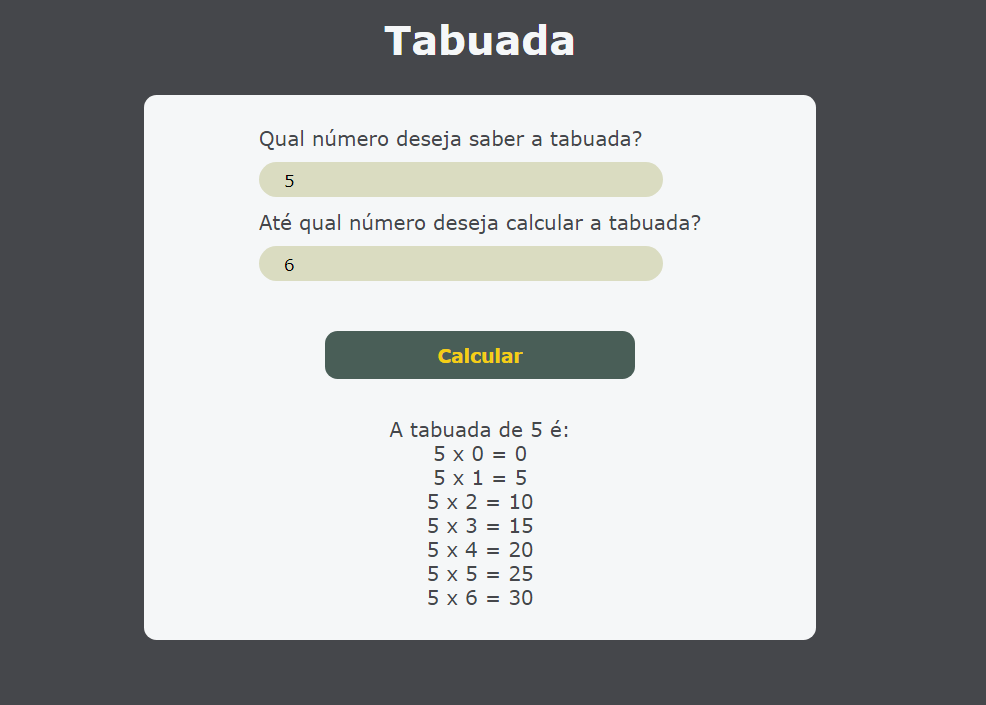

# Tabuada

## Visão Geral

O projeto consiste em uma calculadora de tabuada.
O usuário digita o número que será calculada a tabuada e também o número máximo de vezes que será feita a operação.
Ao clicar em "Calcular", o sistema mostra na tela, linha a linha, os valores das operações e seus respectivos resultados.

## Screenshots

## Deploy

Link do deploy: https://classy-melba-141347.netlify.app
